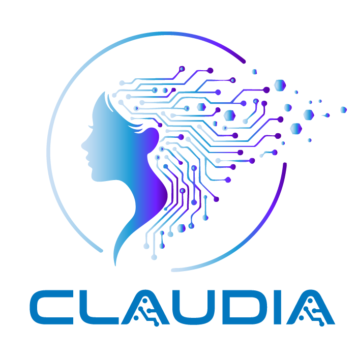

# Claudia

<div style="text-align: center; background-color: #fff; padding: 16px; margin-bottom: 16px;">
  
</div>

A personal AI assistant platform built around Claude Code CLI. One gateway, one port, every interface.

## Overview

Claudia is a gateway-centric architecture for interacting with Claude through multiple interfaces — web, CLI, macOS menubar, iOS, iMessage, and voice. Unlike approaches that wrap the CLI for "remote control," Claudia's gateway IS the control plane. Sessions can be created from any client, anywhere.

**Port 30086** — SHA256("Claudia") → `7586...` → `30086`. Claudia's port.

```
┌──────────────────────────────────────────────────────────┐
│              Gateway (port 30086)                         │
│                                                          │
│  Bun.serve:                                              │
│    /ws  → WebSocket (all client communication)           │
│    /*   → Web UI (SPA shell + extension pages)           │
│                                                          │
│  ┌──────────────┐  ┌──────────────┐  ┌────────────────┐  │
│  │   Session    │  │   Event      │  │   Extension    │  │
│  │   Manager    │  │   Bus        │  │   System       │  │
│  │  (SQLite)    │  │  (WS pub/sub)│  │  (pluggable)   │  │
│  └──────────────┘  └──────────────┘  └────────────────┘  │
│                          │                                │
│         ┌────────────────┼────────────────┐               │
│         │                │                │               │
│    ┌────┴────┐     ┌─────┴─────┐    ┌─────┴─────┐        │
│    │  Chat   │     │   Voice   │    │ iMessage  │        │
│    │  ext    │     │   ext     │    │   ext     │        │
│    └─────────┘     └───────────┘    └───────────┘        │
└──────────────────────────────────────────────────────────┘
         │ WebSocket (ws://localhost:30086/ws)
    ┌────┼─────────┬──────────┬──────────┐
    │    │         │          │          │
 ┌──┴──┐ ┌──┴──┐ ┌──┴──┐ ┌───┴───┐ ┌───┴───┐
 │ Web │ │ CLI │ │ 💋  │ │  iOS  │ │VS Code│
 │ UI  │ │     │ │Menu │ │  App  │ │  ext  │
 └─────┘ └─────┘ └─────┘ └───────┘ └───────┘
```

## Quick Start

```bash
# Install dependencies
bun install

# Start Claudia (single command — serves web UI + WebSocket + extensions)
bun run dev

# Open http://localhost:30086
```

That's it. One command, one port, everything works.

## Architecture

### Single Server

The gateway serves everything on port 30086:
- **WebSocket** (`/ws`) — all client communication (req/res/event protocol)
- **Web UI** (`/*`) — SPA with client-side routing, served as fallback
- **Health** (`/health`) — JSON status endpoint

### Everything is an Extension

Every feature — including the web chat UI — is an extension:

| Extension | Type | What it does |
|-----------|------|--------------|
| `chat` | Client routes | Workspace list, session list, chat pages |
| `voice` | Server + client | ElevenLabs TTS, auto-speak responses |
| `imessage` | Server | iMessage bridge, auto-reply to allowed contacts |

Extensions can provide:
- **Server methods** — `voice.speak`, `imessage.send` (handled via WebSocket)
- **Web pages** — React components in `pages/` with route declarations in `routes.ts`
- **Event handlers** — subscribe to session events, emit their own

### Client-Side Routing

Zero-dependency pushState router (~75 lines). Extensions declare routes:

```typescript
// extensions/chat/src/routes.ts
export const chatRoutes: Route[] = [
  { path: "/", component: WorkspacesPage },
  { path: "/workspace/:workspaceId", component: WorkspacePage },
  { path: "/session/:sessionId", component: SessionPage },
];
```

The web shell (`packages/gateway/src/web/`) just collects routes from all extensions and renders a `<Router>`.

### Session Management

- **Workspaces** — map to project directories (CWD-based)
- **Sessions** — Claude Code CLI sessions, tracked in SQLite
- **History** — parsed from JSONL files with server-side pagination (limit/offset)
- **Multi-client** — VS Code auto-discovers by CWD, web client navigates explicitly

### WebSocket Protocol

```typescript
// Client → Gateway (request)
{ type: "req", id: "abc", method: "session.prompt", params: { content: "Hello" } }

// Gateway → Client (response)
{ type: "res", id: "abc", ok: true, payload: { sessionId: "..." } }

// Gateway → Client (streaming event)
{ type: "event", event: "session.content_block_delta", payload: { delta: { text: "Hi!" } } }
```

## Project Structure

```
claudia/
├── packages/
│   ├── gateway/          # Core server — sessions, events, extensions, web serving
│   ├── sdk/              # claudia-sdk — Claude Code CLI wrapper
│   ├── shared/           # Shared types and utilities
│   └── ui/               # Shared React components + router
├── clients/
│   ├── web/              # SPA shell (index.html + route collector, ~30 lines)
│   ├── menubar/          # macOS "Hey babe" app (SwiftUI) 💋
│   └── ios/              # React Native mobile client
├── extensions/
│   ├── chat/             # Web chat pages (workspaces, sessions, chat)
│   ├── voice/            # ElevenLabs TTS + auto-speak
│   └── imessage/         # iMessage bridge + auto-reply
└── docs/
    └── ARCHITECTURE.md   # Detailed architecture docs
```

## Creating an Extension

Extensions follow a simple convention:

```
extensions/<name>/
  package.json
  src/
    index.ts              # Server-side: methods, events, lifecycle
    routes.ts             # Client-side: page routes (optional)
    pages/                # React page components (optional)
      SettingsPage.tsx
```

**Server-side** (methods + events):
```typescript
export function createMyExtension(): ClaudiaExtension {
  return {
    id: "my-ext",
    name: "My Extension",
    methods: ["my-ext.doSomething"],
    events: ["my-ext.happened"],
    async start(ctx) { /* subscribe to events, init resources */ },
    async stop() { /* cleanup */ },
    async handleMethod(method, params) { /* handle RPC calls */ },
    health() { return { ok: true }; },
  };
}
```

**Client-side** (web pages):
```typescript
// extensions/<name>/src/routes.ts
export const myRoutes: Route[] = [
  { path: "/ext/my-ext", component: MyPage, label: "My Extension" },
];
```

Import in `packages/gateway/src/web/index.tsx` and add to `allRoutes`.

## Configuration

Gateway reads from `claudia.json` or environment variables:

| Variable | Description | Default |
|----------|-------------|---------|
| `CLAUDIA_PORT` | Gateway port | `30086` |
| `CLAUDIA_EXTENSIONS` | Extensions to load | `voice,imessage` |
| `ELEVENLABS_API_KEY` | ElevenLabs API key | required for voice |
| `CLAUDIA_THINKING` | Enable extended thinking | `true` |
| `CLAUDIA_MODEL` | Claude model | `claude-sonnet-4-20250514` |

## Development

```bash
bun run dev          # Start gateway (serves everything)
bun test             # Run tests
bun run typecheck    # Type check
```

## Networking

Claudia uses **Tailscale** for secure remote access. The gateway is accessible from any device on the tailnet via `claudia-gateway.kiliman.dev`. Caddy handles TLS termination.

## License

MIT

---

*Built with love by Claudia* 💙
